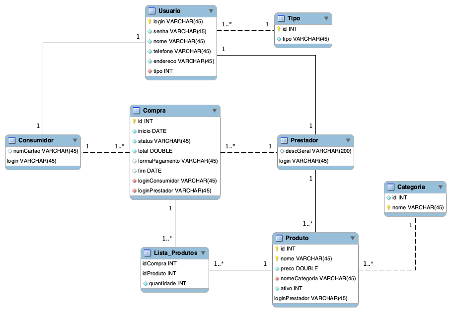

> ### Projeto prático 01: Intermediando necessidades e capacidades.
> 
> Marcelo Bittencourt do Nascimento Filho.
>
> Banco de Dados - Março de 2021 


## Primeira Entrega: Modelagem do Banco (07/03/2021)

   <p align="center">  
        
   </p> 
   
A modelagem final do banco está descrita no diagrama acima, suas característica são:
* **Entidade Usuário**: Armazena dados gerais de um usuário do sistema, possui como chave primária o atributo *login* e realiza um relacionamento muitos-para-um com a entidade Tipo, a qual representa o tipo de usuário do sistema (consumidor ou prestador). Essa entidade também implementa uma especialização total com as entidades Consumidor e Prestador para diferenciar as variadas modalidades de usuários.
* **Entidade Tipo**: Armazena os diferentes tipos de usuários do sistema.
* **Entidade Consumidor**: Entidade especializada de Usuário responsável pelas informações de um usuário do tipo consumidor. Possui como chave primária o atributo *login*. O  atributo *numCartao* aceita valores nulos e representa o número do cartão do usuário, o qual poderá servir para futuras implementações do projeto.
* **Entidade Prestador**: Armazena dados do usuário assim como a entidade anterior, porém somente de contas do tipo prestador. O atributo que aceita valores nulos é o *descGeral*, criado para caso o vendedor queira realizar uma breve descrição de sua empresa. Também possui como chave primária o atributo *login*. 
* **Entidade Produto**: Contém as informações de um produto de um determinado prestador. Realiza um relacionamento identificador com a Entidade Prestador, possuindo como chaves primárias um identificador único (atributo *id*), o seu nome (atributo *nome*) e o identificador de seu prestador (atributo *idPrestador*). O atributo *ativo* indica se aquele produto ainda está disponível para venda, e *idCategoria* indica à qual categoria de serviços o produto pertence.
* **Entidade Categoria**: Categorias de produtos e serviços do sistema. Cada produto possui uma chave estrangeira dessa entidade, a qual especifica a categoria do mesmo.
* **Entidade Compra**: Essa entidade é resultante da relação entre as entidades Consumidor e Prestador. Possui como chave primária um identificador único (atributo *id*) e como chaves estrangeiras os atributos *loginConsumidor* e *loginPrestador*, os quais referenciam a entidade Consumidor e Prestador, respectivamente. Observando a cardinalidade das relações, é possível concluir que uma ocorrência de Consumidor pode se relacionar muitas vezes com uma ocorrência de Prestador, ou seja, um Consumidor pode comprar várias vezes de um Prestador. 
* **Entidade Lista_Produtos**: É importante destacar que em uma única Compra podem haver vários produtos (todos de um mesmo Prestador), com isso a entidade Compra possui uma relação com a entidade Produto denominada de Lista_Produtos. Essa entidade possui como chave primária os atributos *idCompra* e *idProduto*, que referenciam uma ocorrência da entidade Compra e uma da entidade Produto, respectivamente. O atributo *quantidade* informa a quantidade de um mesmo produto em uma compra.


## Segunda Entrega: Desenvolvimento da aplicação (26/03/2021)

### 1. Introdução 

O presente projeto visa implementar um sistema de compra e prestação de serviços ou produtos de forma totalmente online,
evitando o contato pessoal entre consumidor e prestador  para assim tornar uma negociação mais segura em relação à pandemia 
do COVID-19. A primeira etapa do trabalho foi realizar a modelagem de um banco de dados para essa aplicação, nela foi possível 
aplicar todos os conceitos estudados até então na disciplina, para que dessa forma fosse possível tentar atingir o máximo de 
eficiência no que tange às consultas e dados armazenados. A versão final do sistema desenvolvido permite aos usuários realizarem as seguintes ações:

**1) Usuário consumidor**: </br>
a) Realizar uma compra de acordo com a categoria de serviços que deseja, assim como escolher o prestador que mais o satisfaz; </br>
b) Listar todas as suas compras já realizadas (compras concluídas e pendentes); </br>
c) Listar todas as suas compras que ainda não foram finalizadas (compras pendentes). </br>

**2) Usuário prestador**: </br>
a) Visualizar todas as suas compras finalizadas; </br>
b) Visualizar todas as suas compras pendentes; </br>
c) Finalizar compras pendentes. </br>

### 2. Instruções de compilação

O sistema não permite a criação de usuários nem a inserção de novos produtos, serviços ou categorias. Dessa forma, foi disponibilizado 
o arquivo *banco.sql* contendo todas as instruções DDL e DML do banco de dados. Ao utilizar esse arquivo em sua máquina para gerar um banco de dados 
local com os dados necessários para o teste da aplicação, certifique-se de que o nome do *schema* criado é **pp01** (caso você utilize a ferramenta MySQL WorkBench vá em Server > Import Data e importe o arquivo em questão). Após criar o banco a partir do 
arquivo *banco.sql*, informe no arquivo **database.properties** existente no projeto *Java* com *Gradle* suas credenciais e o nome do banco criado. Agora basta 
executar a classe Principal.java para iniciar a aplicação. O bloco abaixo demonstra um exemplo de configuração do arquivo **database.properties**. Observação: Caso em seu sistema já exista um schema com o mesmo nome pp01, exclua e utilize esse novo.

```
user=root
password=123
useSSL=false
host=localhost
port=3306
database=pp01
```

### 3. Utilizando a aplicação

Para utilizar a aplicação será necessário informar um nome de *login* cadastrado no banco, os *logins* abaixo são usuários válidos 
do sistema que já estão armazenados.

**1) Logins consumidor** </br>
* juliana </br>
* miguel </br>
* roberto </br>
* mariaAB </br>
* priscilaD </br>

**2) Logins prestador** </br>
* zecaA </br>
* joao </br>
* marcos </br>
* Lurdes </br>
* mariaprof </br>
* VEG </br>
* academiaACAO </br>
* boxeX </br>
* raul </br>

#### 3.1 *Logado* como usuário do tipo consumidor

Ao entrar no sistema com um usuário do tipo consumidor um menu principal irá ser demonstrado. 

```
 > Menu principal, selecione uma das opções:
 1 - Comprar
 2 - Listar todas as compras
 3 - Listar compras pendentes
 4 - Sair do sistema
```
#### 3.1.1 Comprar

Ao selelecionar a opção 1 (Comprar) o usuário será direcionado a um outro menu onde haverá todas as categorias de produtos e 
serviços disponíveis na aplicação, dessa forma deve-se selecionar uma das opções disponíveis.

```
 > Escolha uma das categorias:
 1 - Comida
 2 - Serviços Gerais
 3 - Roupa
 4 - Transporte
 5 - Educação
 6 - Esporte
 7 - Voltar ao menu principal
```
Ao escolher a categoria, uma lista de todos os prestadores de serviços referentes à ela será demonstrada. Nessa lista haverá o identificador da próxima opção,
o nome do prestador e o seu endereço. Por exemplo:

```
 > Vendedores da categoria ..:: Comida ::..
 1 | Bar do Zeca - Rua A
 2 | Vegano Lanches - Rua v
 3 - Voltar ao menu principal
```

Selecionando um dos vendedores uma breve descrição do mesmo (se o estabelecimento possuir) será mostrada, assim como os produtos disponíveis e seus respectivos valores.
Ao escolher todos os itens necessários o usuário deve escolher a opção "Finalizar compra".

```
 > Vendedor escolhido ..:: Bar do Zeca ::..
 > Descrição do vendedor: O melhor bar do bairro.
 > Produtos disponíveis:
 1 | Porção Mista | R$ 25.9
 2 | Porção Batata | R$ 15.9
 3 | Refrigerante | R$ 5.5
 4 - Finalizar compra
 5 - Voltar ao menu principal
```
Ao escolher todos os produtos, um resumo da compra será mostrado ao usuário e um novo menu aparecerá para determinar a forma de pagamento e se o consumidor realmente deseja finalizar a compra.

#### 3.1.2 Listar todas as compras

A opção 2 do menu principal (Listar todas as compras) apresentará uma tabela com todas as compras do consumidor, sendo elas as finalizadas ou as pendentes.
Nessa tabela haverá as seguintes informações sobre as compras: Código, Prestador, Status, Total, Início e Fim. Caso o usuário queira listar os produtos de uma determinada compra, basta o mesmo inserir o valor da coluna Código no menu abaixo da tabela de compras.

#### 3.1.3 Listar compras pendentes

Por fim, a opção 3 do menu principal (Listar compras pendentes) irá apresentar uma tabela com a mesma estrutura que a descrita na seção 3.1.2, porém apenas para as compras que ainda não foram finalizadas. O usuário também tem a opção de listar os produtos de determinada compra.

#### 3.2 *Logado* como usuário do tipo prestador

Ao entrar no sistema com um usuário do tipo prestador um menu principal irá ser demonstrado

```
 > Menu principal, selecione uma das opções:
 1 - Listar vendas finalizadas
 2 - Listar vendas pendentes
 3 - Finalizar venda
 4 - Sair do sistema
```

#### 3.2.1 Listar vendas finalizadas

A opção 1 (Listar vendas finalizadas) do menu principal irá apresentar uma tabela com todas as informações de todas as vendas finalizadas pelo vendedor, ou seja, 
vendas com o *status* de concluída.

#### 3.2.2 Listar vendas pendentes

A opção 2 (Listar vendas pendentes) do menu principal irá apresentar uma tabela com todas as informações de todas as vendas que ainda não foram concluídas pelo vendedor, ou seja, vendas com o *status* de pendente.

#### 3.2.3 Finalizar venda

Ao selecionar a opção 3 (Finalizar venda) o sistema irá fornecer uma tabela com todas as compras pendentes. Dessa forma, um novo menu irá aparecer questionando o usuário se deseja finalizar alguma venda, para isso basta o mesmo informar o código da compra (o código é demonstrado na tabela citada) que toda a operação será realizada. Ao voltar para
o menu inicial e selecionar a opção 1, será possível confirmar se realmente a venda foi finalizada.

### 4. Exemplo prático

Para realizar testes na aplicação, você pode entrar com o usuário de login *juliana*. Esse usuário possui quatro compras realizadas, dentre elas duas já foram concluídas e duas ainda se encontram pendentes. Com isso, realize uma nova compra para esse usuário seguindo as intruções da seção 3.1.1 e volte ao menu inicial, selecione então a opção *Listar compras pendentes* para visualizar essa nova compra.

Para testar as funcionalidades do tipo prestador, você pode entrar como o usuário de login *zecaA*. Esse usuário possui diversos produtos na categoria *Comida* e também tem algumas vendas já realizadas, dentre elas uma pendente e outra concluída. Realize a ação de finalizar essa venda pendente e volte para o menu inicial, selecione a opção *Listar vendas finalizadas* para verificar se a venda foi realmente finalizada.

### 5. Objetivos alcançados

Como citado, a versão final do programa permite os diferentes tipos de usuários realizarem toda as ações que foram descritas no documento referente às regras de negócio do projeto. 

