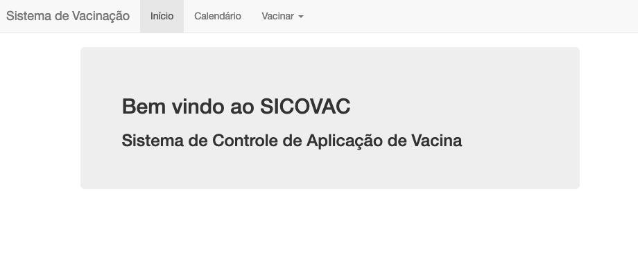

> ### Projeto prático 02: Sistema de Controle de Aplicação de Vacinas - SICOVAC.
> 
> Marcelo Bittencourt do Nascimento Filho.
>
> Banco de Dados - Abril de 2021 

## Primeira Entrega: Modelagem do Banco (04/04/2021)

O diagrama abaixo demonstra a modelagem do banco de dados para a presente aplicação. Todo o seu desenvolvimento se baseou nas regras
de normalização, tentando evitar ao máximo a redundância e anomalia dos dados armazenados.

   <p align="center">  
        
   </p> 

## Segunda Entrega: Desenvolvimento da aplicação (18/04/2021)

### 1. Introdução

A segunda etapa desse projeto visa desenvolver uma aplicação web para o controle do histórico de vacinação de determinado paciente,
o qual facilitará e tornará mais prático o atendimento por parte do profissional que irá aplicar a vacina. Os *frameworks* e tecnologias 
utilizados na realização do projeto foram: Flask, Bootstrap, Jinja2, SQLAlchemy e MySQL. O sistema é capaz de realizar os seguintes serviços:

**1) Visualização do calendário anual de vacinação;** </br>
**2) Cadastro de pacientes;** </br>
**3) Verificação de histórico e processo de vacinação.** </br>

### 2. Instruções de compilação

Para uma melhor experiência do sistema, é disponibilizado o arquivo *banco.sql* contendo todas as instruções DDL e DML do banco de dados. Ao utilizar esse arquivo em sua máquina para gerar um banco de dados local com os dados necessários para o teste da aplicação, certifique-se de que o nome do *schema* criado é **pp02marcelo** (caso você utilize a ferramenta MySQL WorkBench vá em Server > Import Data e importe o arquivo em questão). Após criar o banco a partir do 
arquivo *banco.sql*, basta realizar a seguinte alteração no arquivo **app.py**:

```
app.config['SQLALCHEMY_DATABASE_URI'] = 'mysql+pymysql://<SEU USUÁRIO>:<SUA SENHA>@localhost:3306/pp02marcelo'
```

Para compilar o projeto basta realizar a instalação das dependências descritas no arquivo *requirements.txt* e executar o comando:

```
python3 app.py
```

### 3. Utilizando a aplicação

No banco de dados fornecido há algumas pessoas já cadastradas com diferentes idades, sendo elas:

| CPF        | Idade  |
| -----------| -------|
| 11111111111| 4 meses|
| 22222222222| 60 anos|
|33333333333 | 3 meses|

##### 3.1 Tela inicial

Ao entrar no sistema o usuário será direcionado à página inicial da aplicação onde haverá algumas informações básicas do projeto.

   <p align="center">  
        
   </p> 

##### 3.2 Calendário de vacinação

Na aba **Calendário** o usuário poderá selecionar algum ano e verificar através de uma tabela as vacinas obrigatórias, as doenças que ela evita e as faixas etárias em que se deve aplicar essa vacina. Por exemplo, a vacina Tríplice Bacteriana evita as doenças Difteria, Tétano e Coqueluche e deve ser aplicada aos 2, 4 e 6 meses de idade (três doses).

   <p align="center">  
        
   </p>

#### 3.3 Cadastro de paciente

Caso o paciente ainda não esteja cadastrado o usuário pode realizar essa ação na aba **Vacinar > Cadastrar**, o qual deve informar as dados pessoais básicos do cidadão.

   <p align="center">  
        
   </p>

#### 3.4 Pesquisando paciente

Para encontrar algum paciente no sistema basta ir em **Vacina > Pesquisar** e informar o CPF.

   <p align="center">  
        
   </p>

#### 3.5 Histórico

Ao selecionar o paciente, uma nova tela será apresentada. Nela será possível visualizar as dados do paciente, as próximas doses de vacinas agendadas, quais as vacinas pendentes para a sua faixa etária e uma tabela que demonstra o seu histórico. Essa última tabela indica a Vacina Geral, o nome da vacina aplicada, o local e a data de aplicação, a dose e a quantidade de doses total para garantir a imunidade de acordo com a vacina aplicada. Para realizar a vacinação o usuário deve clicar sobre o ícone de *seringa* presente no quadro *Vacinas pendentes na sua faixa etária*, o qual será redirecionado para outra página. É importante destacar que a coluna **dose** da tabela *Vacinas pendentes na sua faixa etária* representa o número da dose atual para aquele tipo de vacina no geral, porém, dependendo da vacina aplicada essa dose pode variar pois um fabricante pode informar que a imunidade está garantida com 2 doses e outros fabricantes informam que será garantida com 3 doses. Dessa forma, o profissional deverá ficar atento a qual vacina o paciente recebeu anteriormente e verificar se o mesmo já se encontra imunizado a partir do histórico.

   <p align="center">  
        
   </p>

#### 3.6 Realizando a vacinação

Ao escolher qual o tipo de vacina o paciente irá receber, o usuário será direcionado para essa página a qual deverá escolher dentre as vacinas disponíveis em estoque a correta para o paciente. Também deverá informar qual o número da dose que está sendo aplicada e o local do atendimento. Por fim o sistema retornará à página anterior, informando em alguns casos qual a próxima data de retorno do paciente no quadro *Próximas doses*.

   <p align="center">  
        
   </p>

###  4. Considerações

Por ser tratar de um trabalho acadêmico alguns nomes, número de doses por frasco, data de validade e outras características relacionadas às vacinas, assim como nome de pessoas e seus respectivos CPFs são fictícios, e foram definidos dessa maneira apenas para fins didáticos e para testes do sistema.


